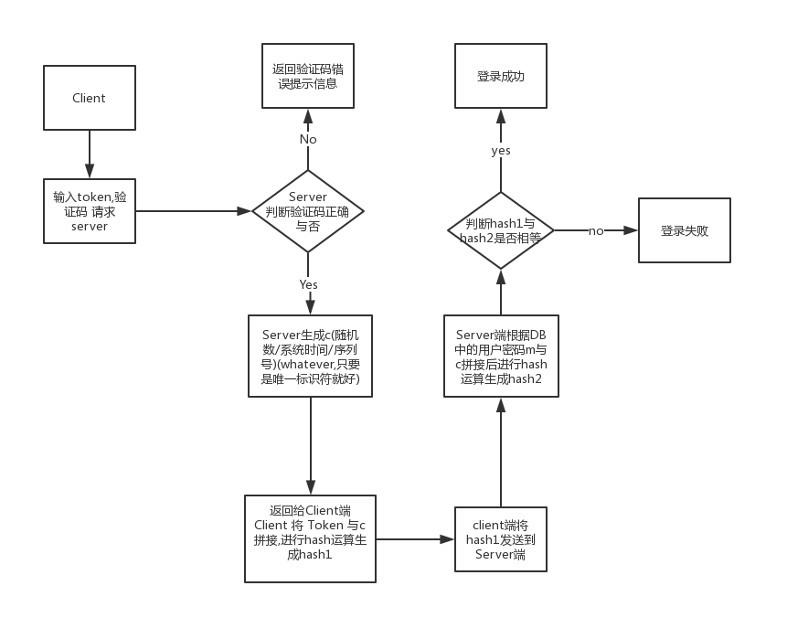

### 概述:
> 这篇文章主要说一说如何自助设计实现系统登录模块,实现抗重放攻击,的实现步骤,其次是进行一波资料的推广(不喜勿喷)
> 软件系统登录设计实现抗重放攻击

### 抗重放攻击的设计与实现

#### 重放攻击原理: 
> 是把以前窃听到的数据原封不动地重新发送给接收方。

#### 抗重放攻击原理:
> 使用户请求唯一

#### 图示过程: 

- 图示过程已经很清楚,我就不在一一举例说明了,对一下内容进行特殊说明:

- 验证码的作用是为了向服务器请求获取随机数,至于 验证码要如何生成,请自己查阅有关资料进行设置
- 验证码验证成功后,系统可以在一下三个选项中选择一个,作为抗重放攻击的利器返回给客户端,以实现抗重放攻击
    - **加随机数**。该方法优点是认证双方不需要时间同步，双方记住使用过的随机数，如发现报文中有以前使用过的随机数，就认为是重放攻击。缺点是需要额外保存使用过的随机数，若记录的时间段较长，则保存和查询的开销较大。
    - **加时间戳**。该方法优点是不用额外保存其他信息。缺点是认证双方需要准确的时间同步，同步越好，受攻击的可能性就越小。但当系统很庞大，跨越的区域较广时，要做到精确的时间同步并不是很容易。
    
    - **加流水号**。就是双方在报文中添加一个逐步递增的整数，只要接收到一个不连续的流水号报文(太大或太小)，就认定有重放威胁。该方法优点是不需要时间同步，保存的信息量比随机数方式小。缺点是一旦攻击者对报文解密成功，就可以获得流水号，从而每次将流水号递增欺骗认证端。
    
- 注意: 原则上,Server端DB中存储的用户口令应该是hash值的形式,以防内部人员做出鸡鸣狗盗之事.

#### 参考链接: 
- [如何防止别人抓包重放攻击](https://www.cnblogs.com/jay54520/p/6181604.html?utm_source=itdadao&utm_medium=referral)

- [防重放攻击](https://blog.csdn.net/srp123/article/details/78989708)

###　资源推荐：
- 中国Mooc 计算机网络  hit , [传送门](https://www.icourse163.org/course/HIT-154005)

> 这是我唯一一门及格的网课(pass 加上考试时自己不要脸翻书做题),给我的感受,你觉得你会了,来做道题,然后紧接着就自闭了,我自我感觉这门课完全可以作为考研狗的计算机网络复习课,可别说你会计算机网络,不信,做道题? 

> 假设Alice想给Bob发送一封邮件； Bob拥有公钥-私钥对(KB+，KB–)，Alice有Bob的证书，但是Alice没有公钥-私钥对；Alice和Bob共享相同的散列函数H(·)。请回答下列问题：

>1). 在这种情况下，是否能设计一个方案使得Bob可以核实邮件消息是由Alice创建的？如果能，请绘制框图解释该方案；如果不能，请简单解释原因。

>2). 能否设计一个方案，支持Alice向Bob发送机密性邮件？如果能，请绘制方案框图；如果不能，请简单解释原因

>另外,对于网络安全方面,这个老师对我也有很好的启蒙性,在这里感谢下这个老师!!!

- 华盛顿大学 Computer network (一个学长推荐的,没有看过,不过他跨考成功了,去了 zju ,自行斟酌, 这个视频貌似b站上是有的, 我没有找不过大概还是有的)
> 链接: https://pan.baidu.com/s/1uKLuD9idz-xALD7i3F2ehA 提取码: q9zq 复制这段内容后打开百度网盘手机App，操作更方便哦11

        话说,貌似跑题了,明明是NetworkInformationSecurity,为啥跑偏了呢?

关于网络安全的相关课程,我只知道一些tcpip协议栈的视频地址,网址是 www.51cto.com, 里面的资料还是挺全的, 还有作为有一个程序员,B站的魅力你必须要领略下,这真的是一个大宝藏,你可以挖出很多东西?

接下来进入正题: (不要因为这几部剧毁掉了your future.)

- 美剧　Mr.Robot 黑客帝国 [传送门](https://movie.douban.com/subject/26290409/)
> 这是一部心理剧,虽说剧情有点夸张,但也算是从某种程度上说明了网络安全的重要性
>  不知道有多少人会错过这部剧。它外表如此低调，内心却如此招摇。潜藏在美剧颇为尴尬的夏季档期中，悄无声息地与拼颜值的ABC台和屡败屡战的脑残Syfy台直面相撞，还得应付着沃卓斯基姐弟亲自执导并编剧的科幻题材。
> 今年的夏季档中，科幻剧占了一大半。这部《黑客军团》算是半个科幻题材吧。如今这个中文译名直白粗暴，本来人家的名字叫Mr. Robot，可以看看剧，再体会下。
- 暗网2.解除好友 [传送门] (https://movie.douban.com/subject/26725678/) 
> 恐怖片,慎入
### 注意:
以上内容，作者一字一句码出来的，纯属不易，欢迎大家转载，转载是还请您表明出处。另外如果我有侵权行为，请在下方留言，确认后我会及时撤销相应内容，谢谢大家！

PS:欢迎大家来到我的小站,和我一起记录属于我们自己的大学！

　
